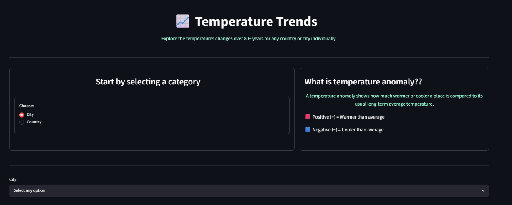
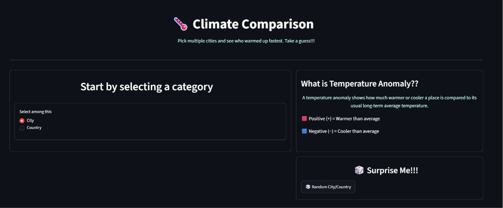
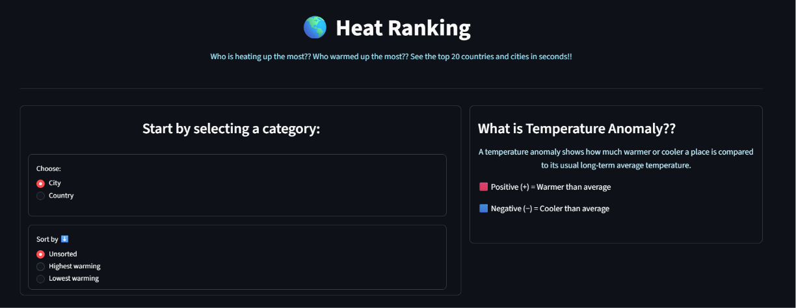
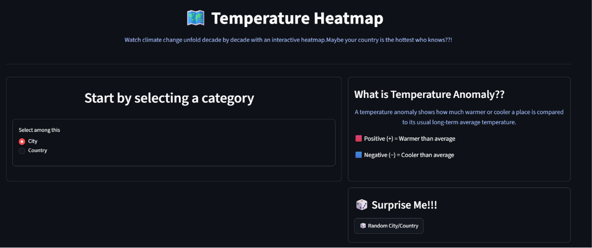
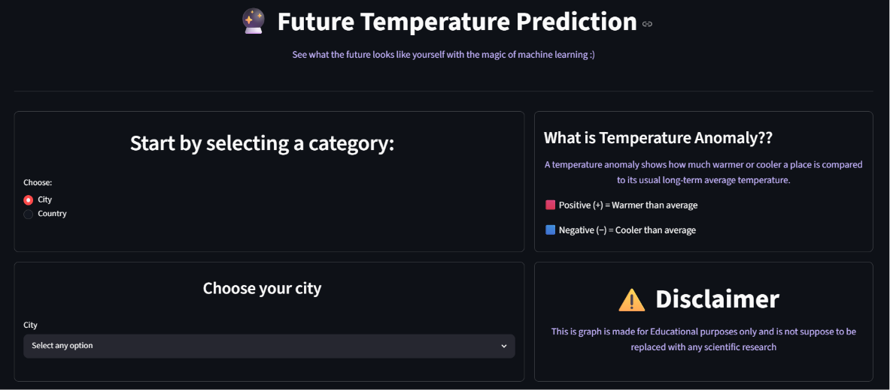
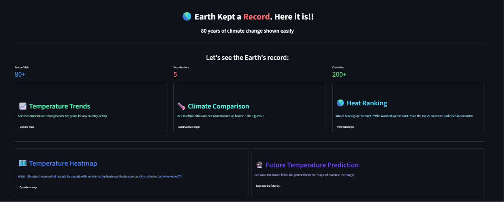

# 🌍 The Earth Kept a Record. Here It Is.

### 80+ Years of Climate Change Through Interactive Visualizations


# Overview ✔️
> The Earth Kept a Record. Here It Is.
> It is an interactive climate visualisation web application built with Streamlit and Plotly. 
> Using over 80 years of real-world temperature data, 
> users can explore climate trends through five interactive visualisations, compare cities and countries, 
> view temperature rankings, explore decade-based heatmaps, and generate future temperature predictions using machine learning. 
> The goal of the project is to make climate data simple, engaging, and easy to understand for everyone. 

---

# What is a Temperature Anomaly? ✔️

A temperature anomaly shows how much warmer or cooler a place is compared to its usual long-term average temperature.
Scientists use temperature anomalies because they remove the natural temperature differences between regions and climates. Instead of comparing absolute temperatures, anomalies compare every location against its own long-term average.
This makes historical climate trends much easier to compare across different places and allows abnormal warming or cooling to be identified more accurately.

🟥 Positive (+) = Warmer than average

🟦 Negative (−) = Cooler than average

---

# Main Features ✔️

## Temperature Trends
This graph basically shows the actual temperature for any one city and the temperature anomaly for any one country.

The users can see the Temperature change of that specific city/country 

This feature shows a line graph
### Image: 


## Climate Comparison
The users can select upto 7 cities/countries. Then they can compare them while having a line graph. 
If the user does not feel the need to select they can also opt for the random option which would give them the graph containing 7 random cities/ countries based on there choice of category

This feature would also give a line graph
### Image: 


## Heat Ranking
This feature allows the user to see the top 15 cities/countries as they are ranked. 
They are ranked in two ways one being the highest rankings and the other being lowest ranking.
In the highest ranking they show the top 15 cities (which are available) /countries with the most temperature anomaly change.
In the lowest ranking they show the top 15  cities(which are available)/ countries with the least temperature anomaly change.

This feature shows a horizontal bar graph
### Image: 


## Temperature Heatmap
The users can select upto 7 cities/countries. Then they can compare them while having a Heatmap. 
If the user does not feel the need to select they can also opt for the random option which would give them the graph containing 7 random cities/ countries based on there choice of category.
In this heatmap the color blue represents cool and red represents hot and the intensity of these colors then better help to understand the heatmap.
In this heatmap decades are used to show a significant amount of change

This feature shows a heatmap
### Image: 


## Future Temperature Prediction
This feature helps user to see the temperature anomaly in the future and for this prediction polynomial regression is used.
Ploynomial regression is set to degree 2 meaning that it would look and predict the values based on the quadratic curve making the predictions more accurate.
Do note that the predictions are only meant for educational purposes only and are not mean to replace any scientific working at all cost.

This feature shows a line graph
### Image: 

---

# Dataset ✔️

This is everything to you need to know about the dataset:

- ## Source of the data.
  - The data for the cities is taken from the **NASA GISS (NASA Goddard Institute for Space Studies)** and processed for visualisation and analysis.
  - The data for countries is taken from modified **Copernicus Climate Change Service information (2026)**
  – with major processing by **Our World in Data**
- ## Number of countries.
  - Each country in the world is available
- ## Number of cities.
  - There are almost 17 cities available right now
- ## Time period covered.
  - The total time period covered is 80 years. from 1940s to 2025 
- ## Main columns used.

  | Category | Columns                   | Graphs |
  |----------|---------------------------|--------|
  | City     | metANN, YEAR              | Temperature Trends |
  | City     | YEAR, Temperature anomaly | Climate Comparison, Heat Ranking, Temperature Heatmap, Future Temperature Prediction |
   | Country | Year, Temperature anomaly | All 5 graphs |


  
---

# Technologies Used ✔️
The following are the language and the libraries I used and the purpose of them:

| Technology   | Purpose              |
|--------------|----------------------|
| _**Python**_ | _The main program_   |
| _**Streamlit**_ | _The frontend_    |
| _**Plotly**_ | _The graphs_         |
| _**Pandas**_ | _The loading, cleaning, organising, and manipulating the data used_ |
| _**NumPy**_ | _The numerical operations, handling missing values, and preparing data for prediction._ |
| _**Scikit-learn**_ | _The actual prediction model_ |


---

# Project Structure ✔️

```text
Project/
│
├── homepage.py             # This file has the code for the main homepage of the web application
├── data_clean.py           # This file has all the data processing and cleaning functions
├── requirements.txt        # This file stores the requirements of this program and it is needed to install it  
├── README.md               # This file is basically the README.md file which has all the information of the project
│
├── pages/                  # This folder has each of the graph pages which are to be displayed on the web application
│   ├── graph1.py           # This is the page for the Temperature Trends graph
│   ├── graph2.py           # This is the page for the Climate Comparison graph
│   ├── graph3.py           # This is the page for the Heat Ranking graph
│   ├── graph4.py           # This is the page for the Temperature Heatmap
│   └── graph5.py           # This is the page for the Future Temperature Prediction graph 
│
└── Weather station csv/    # This folder contains the CSVs of the 17 cities and the each countries in the world
│   ├── bangkok.csv
│   ├── beijing.csv
│   ├── berlin.csv
│   ├── cairo.csv
│   ├── delhi.csv
│   ├── dubai.csv
│   ├── london.csv
│   ├── madrid.csv
│   ├── moscow.csv
│   ├── multan.csv
│   ├── new york.csv
│   ├── nuuk.csv
│   ├── oslo.csv
│   ├── paris.csv
│   ├── rome.csv
│   ├── seoul.csv
│   ├── singapore.csv
│   ├── sydney.csv
│   ├── tokyo.csv
│   ├── toronto.csv
│   ├── world_data.csv      # The csv containing the data about each countries in the world
│
│
├── assets/                # The images which are going to be in the README.md file
│   ├── graph1.png
│   ├── graph2.png
│   ├── graph3.png
│   ├── graph4.png
│   ├── graph5.png
│   ├── Homepage.png
```

---
# 🌍 Try the project ✔️
🌍 **The Earth Kept a Record. Here It Is.**

👉 https://the-earth-kept-a-record-here-it-is-vavg5teg69z5fpeqsqcren.streamlit.app/

No installation is required.
Simply open the link in your browser and start exploring.

## Homepage preview


---
# How to Use ✔️
Inorder to use this web application.

Kindly follow this steps.

1. Open the homepage.
2. Choose a graph.
3. Select City or Country.
4. Interact with the controls.
5. Explore the results.

_As simple as that_


---

# Challenges ✔️

The Challenges I faced in this project were:

- Learning streamlit from scratch as I didn't have experience with it before. 
- Handling the different CSVs formats as the cities CSV were in actual temperature formats whereas the countries CSV was in temperature anomaly format and I eventually choose the Temperature anomaly as it is more scientifically accepted format
- Building the prediction graph as I didn't know how to do regression instead I knew classification so I had to learn it first.
---

# What I Learned When I Did This: ✔️

- Streamlit web application development
- Polynomial regression
- UI and user experience design
---

# Future Improvements ✔️

If this project has further expansion I would likely add:

- Almost all cities worldwide
- Much better UI
- Better prediction model the one that uses different factors and then predict according to those factors
- Scientifically backed predictions that can be used for research
- Better mobile layout
- Download graphs as png
- User customisation like themes
- A research tab to help with climate change related topics and stuff

---

# Educational Disclaimer ✔️

The predictions in the prediction graphs are purely based on historical data and this can not replace the scientific research.
This project is only intended for learning and exploration only.
